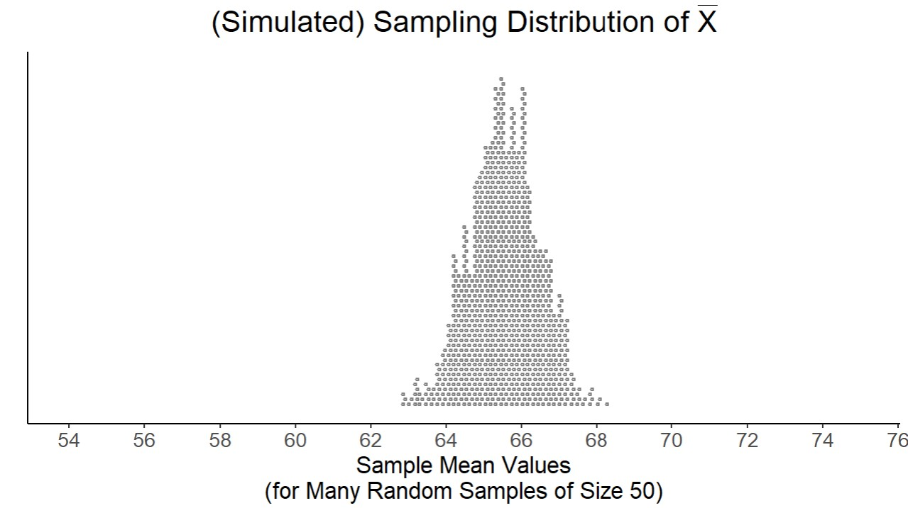

```{r setup, include=FALSE}
knitr::opts_chunk$set(echo = TRUE)
```


### Instructions

Complete the lab exercises and Dive Deeper questions below. Lab exercises will be graded out of 2 points each and the Dive Deeper questions will be graded out of 3 points each - all of them will be graded for *correctness*. Upon completion, follow the submission instructions at the bottom of this document. We strongly encourage you to work on this assignment with a partner. 

***

### Background

[Source](https://www.kaggle.com/datasets/stefanoleone992/fifa-22-complete-player-dataset)

FIFA is a popular soccer video game developed by EA Sports. Listed as the best-selling sports video game in the world, FIFA allows gamers to play soccer matches using real players from all over the world. This data set contains information for **every** soccer player competing in the MLS (the most popular soccer league in the US). In other words, this data set contains *the population of all soccer players in the MLS*. (Note: goalkeepers have been removed.) The original file contains over 50 attributes for every player, but we have narrowed it down to the following eight variables.  

1. `club`: team
2. `positions`: a list of positions for the player
3. `height`: height (in cm)
4. `salary`: annual salary (in $1000's)
5. `speed`: speed (out of 100)
6. `shooting`: shooting ability (out of 100)
7. `dribbling`: dribbling ability (out of 100)
8. `defending`: defending ability (out of 100)

Note: the number (1-8) corresponds to the column number of the variable


Use the following code chunk to read in the data set. 

```{r readData}
fifa <- read.csv("fifa.csv", row.names = 1)
```

You can preview the data below.

```{r previewData}
head(fifa)
```

And be sure to load in the required packages!

```{r loadPackages}
library(ggplot2)
library(ggdist)
library(stats250package)
```


***


### Lab Exercises

After reading in the data set above, complete the following lab exercise. Remember, these exercises are worth 2 points each and are graded for correctness.

> **1.** Create a histogram for the heights of the MLS soccer players. Be sure to include appropriate axis labels and a title. Comment on the shape, center, and spread of the histogram.

```{r exercise1, error = T}
# Replace this comment with your code

```

*Answer:* Replace this text with your answer.


> **2.** With the height variable and the `samplingDistXbar()` fuction, create the sampling distribution of the sample mean for random samples of size *4*. What does each dot in the plot represent? Be specific and provide context!

```{r exercise2, error = T}
# Replace this comment with your code

```

*Answer:* Replace this text with your answer.


> **3.** With the height variable and the `samplingDistXbar()` fuction, create the sampling distribution of the sample mean for random samples of size *16*. With this plot (and the plot from Exercise 2), you should find a bell-shaped distribution. The Central Limit Theorem says that we need to take random samples of at least size 25 in order for the resulting sampling distribution to be approximately normal - so why are these plots normal even though we have smaller sample sizes? 

```{r exercise3, error = T}
# Replace this comment with your code

```

*Answer:* Replace this text with your answer. 


> **4.** Pick a different quantitative variable from the FIFA data set. Create a histogram for your chosen variable. Be sure to include appropriate axis labels and a title. Comment on the shape of the histogram (you'll be calculating the mean and standard deviation in Exercise 5, so no need to comment on the center or spread).

```{r exercise4, error = T}
# Replace this comment with your code

```

*Answer:* Replace this text with your answer.


> **5.**  Calculate the mean and standard deviation for the variable you picked in Exercise 4. Would these values be considered parameters (mu and sigma, respectively) or statistics (xbar and s, respectively)? Explain why. Reread the background if you're not sure! 

```{r exercise5, error = T}
# Replace this comment with your code

```

*Answer:* Replace this text with your answer.


> **6.** With the variable you picked in Exercise 4 and the `samplingDistXbar()` fuction, create the sampling distribution of the sample mean for random samples of size *25*. What does each dot in the plot represent? Be specific and provide context!

```{r exercise6, error = T}
# Replace this comment with your code

```

*Answer:* Replace this text with your answer.


> **7.** With the variable you picked in Exercise 4 and the `samplingDistXbar()` fuction, create the sampling distribution of the sample mean for random samples of size *100*. How do the shapes, centers, and spreads of this plot and the plot from Exercise 6 compare? 

```{r exercise7, error = T}
# Replace this comment with your code

```

*Answer:* Replace this text with your answer.


***


### Dive Deeper Questions

After completing the lab exercises above, complete the following Dive Deeper questions. Remember, these questions are worth 3 points each and are graded for correctness.

> **1.** What is more likely - observing an average height of *at least* 174 cm for a random sample of 4 MLS players or for a random sample of 16 MLS players? Explain your reasoning.

*Answer:* Replace this text with your answer.


> **2.** Another variable included in the original data set was *overall* - which measures the overall skill of a player (out of 100). The sampling distribution of the sample mean for random samples of size *50* was created and is provided below. The sampling distribution is bell-shaped, but what about the original overall variable...Can we determine if the shape of the histogram for overall skill is also normally distributed? In other words, if we were to plot the histogram of the variable overall skill for all 680 MLS players, do we know (based on the sampling distribution provided) whether the histogram will follow a normal distrbution? Why or why not?



*Answer:* Replace this text with your answer.


***

### Submission Instructions

Once you have finished, follow the instructions below to submit your work.

1. At the top of the document, update the `author` field. Do not change anything else at the top of the document.

2. Click the Knit button to create an HTML file of your work.

3. In the Files pane (bottom right window), check the box next to `lab03assignment.html`. 

4. In the Files pane, click on the gear icon (More) and select "Export..."  

5. Do not change the file name (`lab03assignment.html`). Click Download and save the file to your computer. 

6. On the Stats 250 Canvas site, navigate to the Lab 3 assignment. 

7. Upload your saved `lab03assignment.html` file. 

8. Click "Submit Assignment". Congratulations, you are done with Lab 3!


